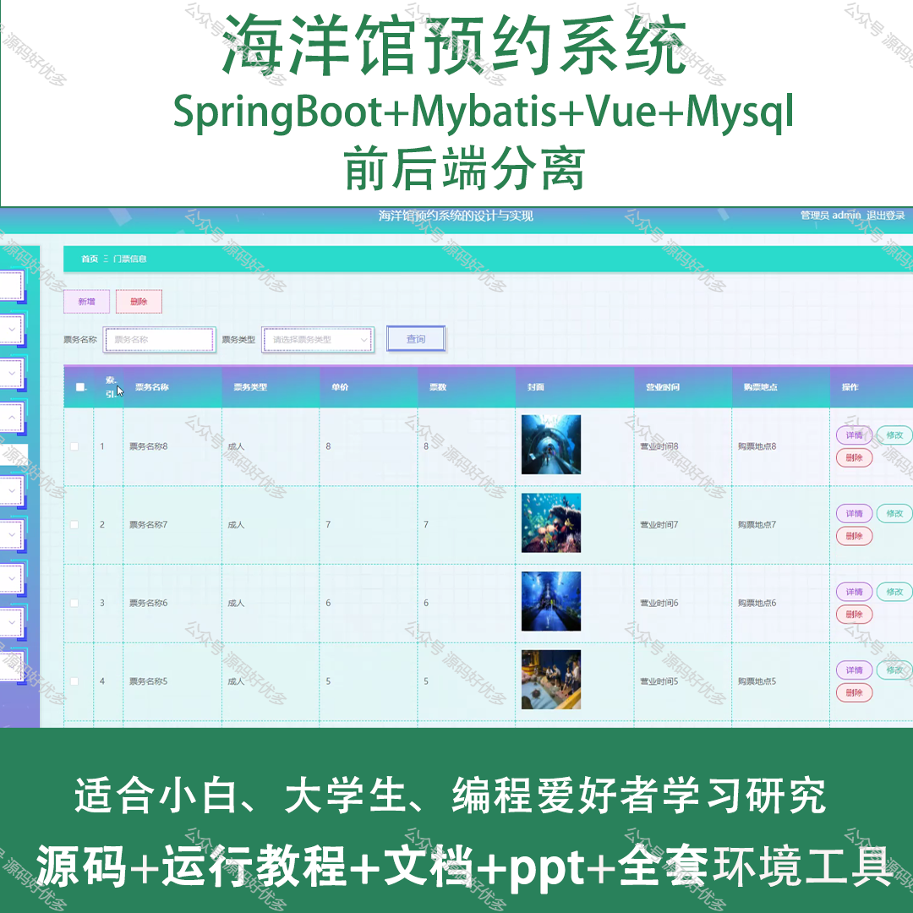
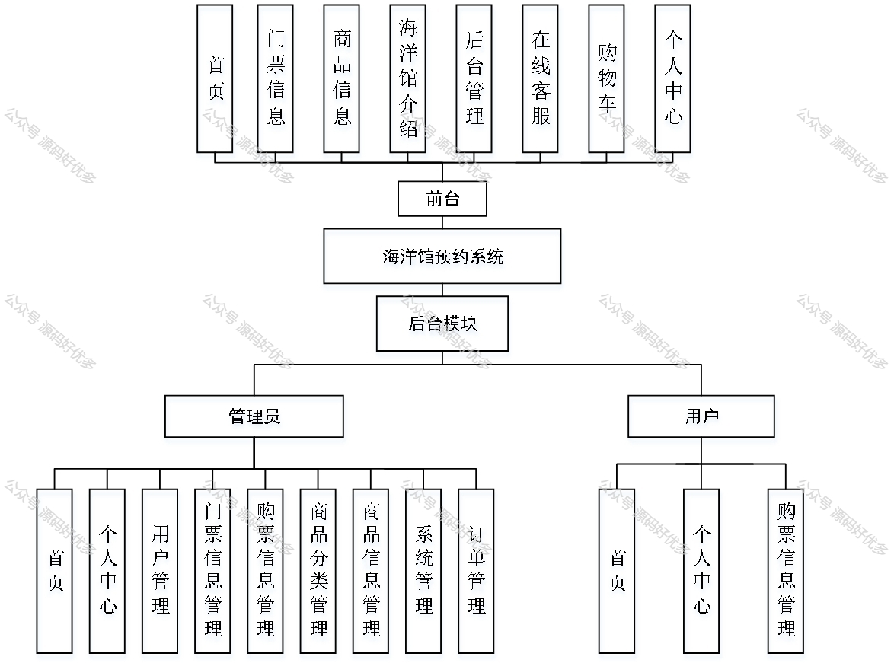
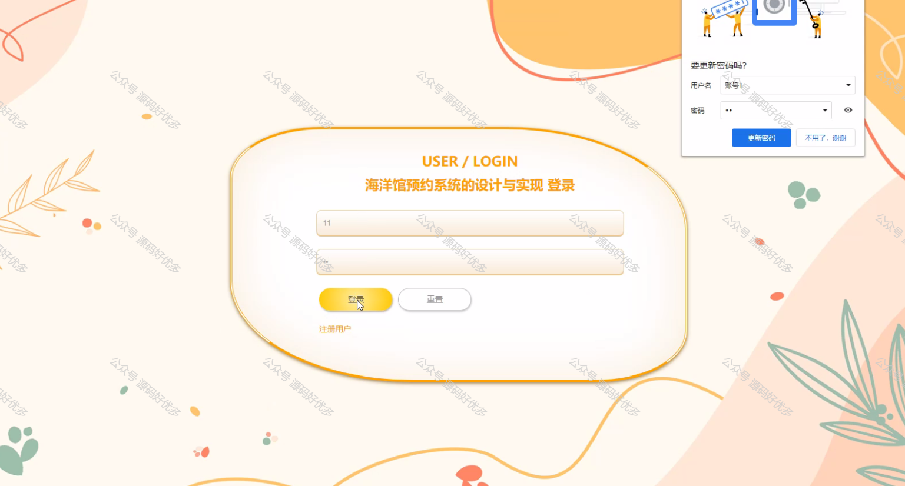
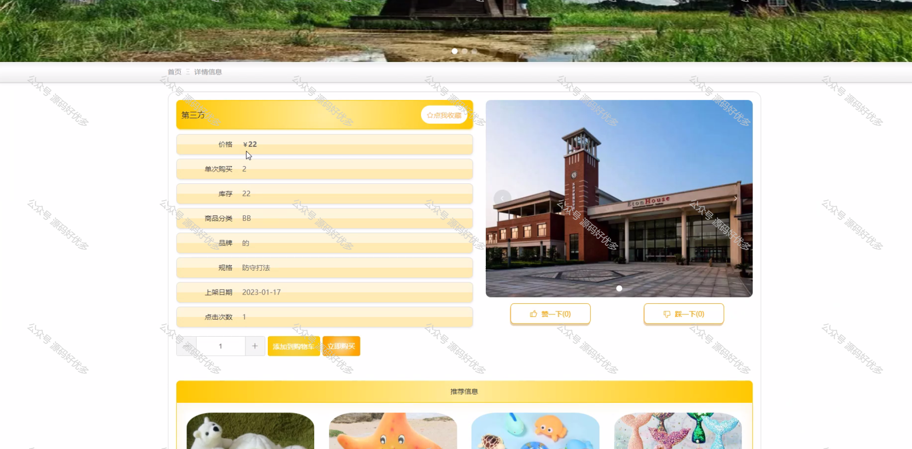
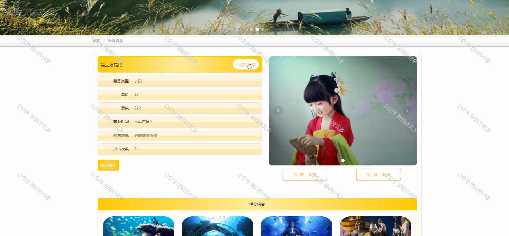
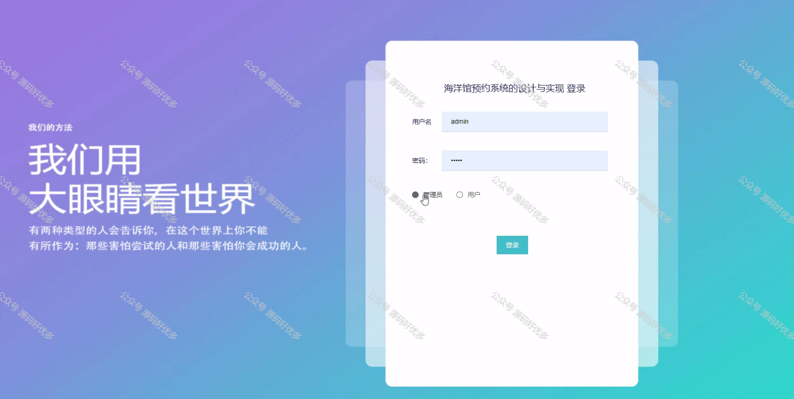
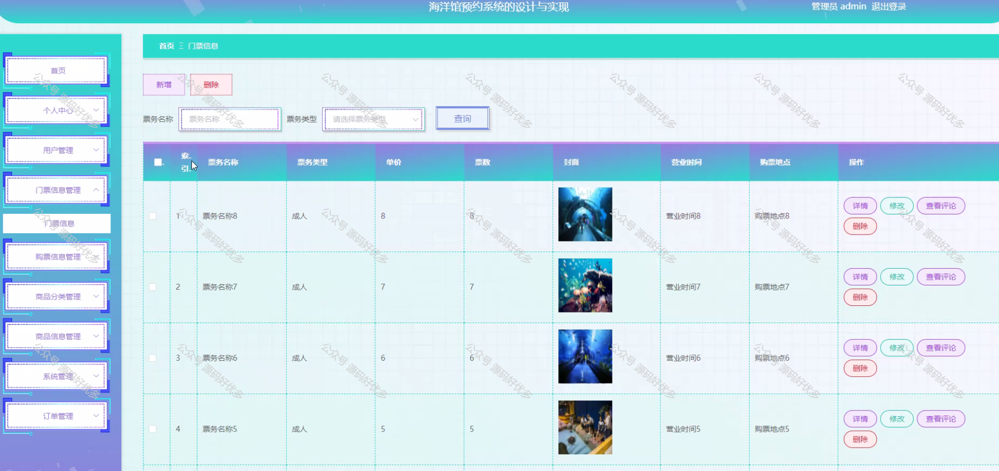
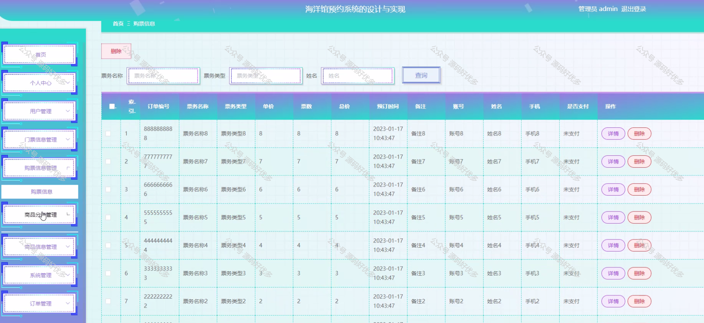
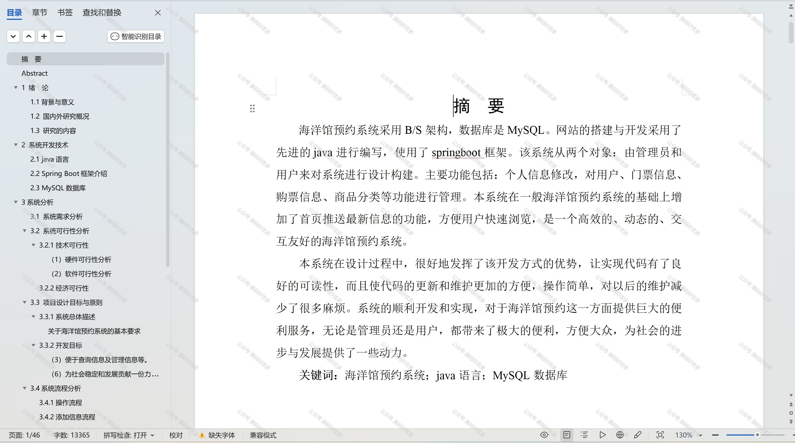

 
## 查看主页获取源码

### 一、作品包含

源码+数据库+设计文档万字+PPT+全套环境和工具资源+部署教程

### 二、项目技术

前端技术：Html、Css、Js、Vue、Element-ui

数据库：MySQL

后端技术：Java、Spring Boot、MyBatis

  

### 三、运行环境

开发工具：IDEA/eclipse

数据库：MySQL5.7

数据库管理工具：Navicat10以上版本

环境配置软件： JDK1.8+Maven3.6.3

前端Nodejs：14

### 四、项目介绍
项目编号：springbootA189

随着旅游业的快速发展和人们对海洋生物认知兴趣的不断提升，海洋馆作为科普教育的重要场所，吸引了大量游客前来参观。为提高游客的参观体验，合理分配参观人数，确保海洋馆的有序运营，海洋馆预约系统的应用显得尤为重要。该系统通过线上预约的方式，帮助游客提前规划参观时间，减少排队等候时间，同时也为海洋馆管理方提供了有效的客流控制手段。

前台用户功能：首页、门票信息、商品信息、海洋馆介绍、后台管理、在线客服、购物车和个人中心。

后台分为管理员和用户
管理员的功能：系统首页、个人中心、用户管理、门票信息管理、购票信息管理、商品分类管理、商品信息管理、系统管理和订单管理。
用户的功能：系统首页、个人中心、购票信息管理。

### 五、运行截图

  
